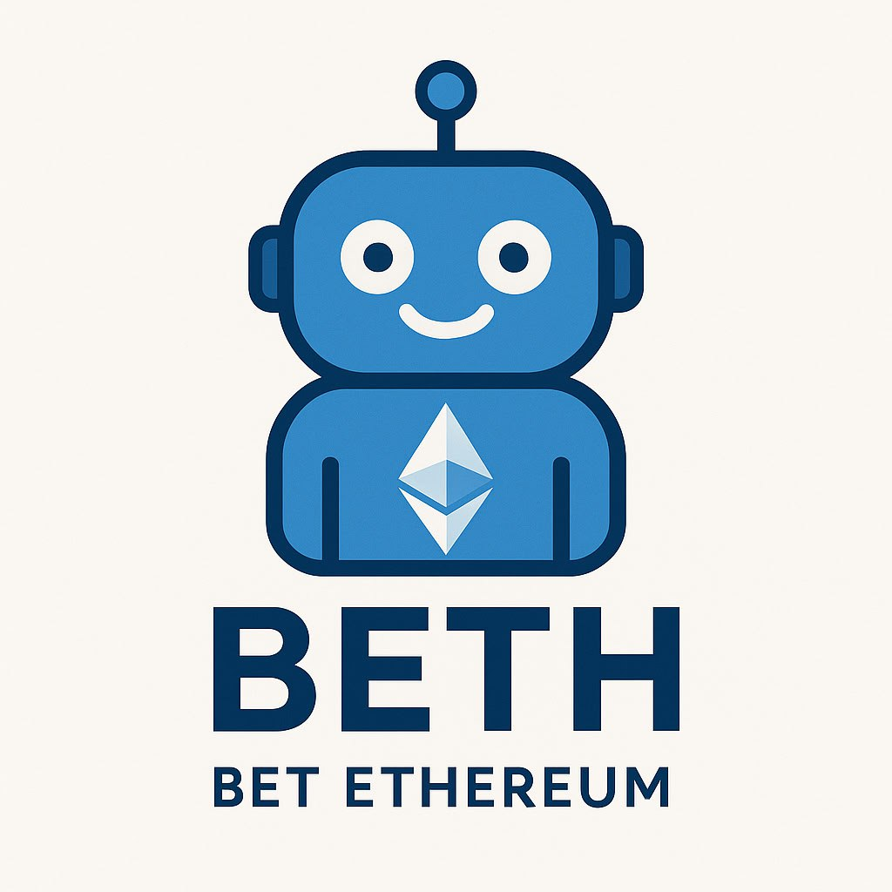

# Ethereum Multi-Token Price Betting Platform

A decentralized betting platform that allows users to bet on cryptocurrency price movements using Chainlink price feeds. The platform supports multiple tokens and provides a Telegram bot interface for easy interaction.

<p align="center">
  
</p>

## Features

- Real-time price betting on multiple cryptocurrencies
- Integration with Chainlink price feeds for accurate price data
- Telegram bot interface for easy betting
- Automated bet resolution using smart contracts
- Transparent and fair reward distribution
- Support for multiple tokens
- Minimum bet amount protection
- Platform fee system
- Emergency pause functionality

## Prerequisites

- Node.js (v16 or higher)
- Foundry (for smart contract development)
- Telegram account

## Installation

1. Clone the repository:

```bash
git clone https://github.com/UrosCBS/beth.git
cd beth
```

2. Install Foundry dependencies:

```bash
forge install
```

3. Install Node.js dependencies:

```bash
npm install
```

4. Install Go dependencies:

```bash
cd bot
npm install
```

## Environment Setup

Create a `.env` file in the root directory with the following variables:

```env
PRIVATE_KEY=
BOT_ADDRESS=
BOT_TOKEN=
RPC_URL=
ETHERSCAN_API_KEY=
MONGODB_URI=
CONTRACT_ADDRESS=

```

## Smart Contract Deployment

1. Build the contracts:

```bash
forge build
```

2. Deploy the contracts:

```bash
forge script script script/DeployTelegramBetting.s.sol:DeployTelegramBetting --rpc-url $RPC_URL --private-key $PRIVATE_KEY --broadcast
```

## Running the Telegram Bot

1. Run local monggo DB instance

```bash
docker run -d -p 27017:27017 -v /data/db:/data/db --name mongodb mongo
``` 

2. Start the bot:

```bash
cd bot
npm start
```

## Bot Commands

The Telegram bot supports the following commands:

### Basic Commands

- `/start` - Initialize the bot and display the main menu
- `/help` - Show available commands and usage instructions

### Wallet Management

- `💰 Connect Wallet` - Generate a new wallet or view existing wallet details
  - Shows wallet address and current ETH balance
  - New wallets need to be funded with ETH before betting

### Betting Commands

- `📈 Create Bet` - Create a new price prediction bet

  - Select token (ETH, BTC, or LINK)
  - Bot will return a bet ID for placing bets

- `/placebet <betId> <direction> <amount>` - Place a bet

  - `betId`: ID of the active bet
  - `direction`: "higher" or "lower"
  - `amount`: Amount in ETH (minimum 0.001 ETH)
  - Example: `/placebet 1 higher 0.1`

- `📊 Active Bets` - View currently active bets

  - Shows bet ID, token, start price, time remaining
  - Displays total amount in higher/lower pools

- `📝 My Bets` - View your betting history
  - Shows all bets you participating in
  - Displays bet status, direction, amount wagered

### Example Usage

1. Connect wallet using `💰 Connect Wallet`
2. Fund your wallet with ETH
3. Create a bet using `📈 Create Bet`
4. Select token (ETH/BTC/LINK)
5. Use `/placebet` with the returned bet ID to place your prediction
6. Monitor active bets with `📊 Active Bets`

### Important Notes

- Bets run for 5 minutes after creation
- Minimum bet amount is 0.001 ETH
- Betting closes 30 seconds before end time
- Platform fee is 2%
- Rewards are distributed after bet resolution

## Contract Architecture

The platform consists of two main components:

1. **Smart Contract (`TelegramMultiTokenPriceBetting.sol`)**:

   - Handles bet creation, placement, and resolution
   - Integrates with Chainlink price feeds
   - Manages token configurations and bet pools
   - Implements security features (reentrancy guard, pausable)

2. **Telegram Bot**:
   - Provides user interface for interacting with the contract
   - Manages bet creation and user interactions
   - Displays bet status and results

## Security Features

- Reentrancy protection
- Emergency pause functionality
- Minimum bet amount protection
- Secure price feed integration
- Access control for admin functions

## 👥 Team

| Name             | GitHub Profile                               |
| ---------------- | -------------------------------------------- |
| Uroš Žigić       | [@UrosCBS](https://github.com/UrosCBS)       |
| Darko Panić      | [@DarkoCBS](https://github.com/DarkoCBS)     |
| Cvijan Đukanović | [@CvijanCBS](https://github.com/CvijanCBS)   |
| Momčilo Miković  | [@MomciloCBS](https://github.com/MomciloCBS) |

## Demo Video

[Add your demo video link here]

## License

This project is licensed under the MIT License
